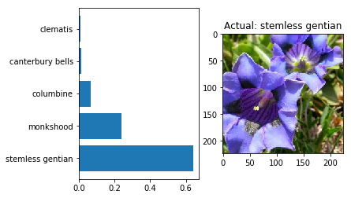

# Prediction Flower Species with PyTorch

This is one of the projects I completed in fulfillment of the Udacity Nanodegree 'Introduction into Machine Learning'. The course teaches how to code an Image classifier and train a neural network to discern various flower species using the PyTorch framework. The network leverages pretrained models and adapts the output layer for the classification of different flower species. The dataset is from http://www.robots.ox.ac.uk/~vgg/data/flowers/102/index.html.

The Jupyter notebook shows the methodical approach in chronological order and is best to learn how to program works. Overall, this gives a nice template for image classification using deep pretrained networks with PyTorch

